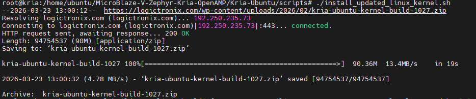
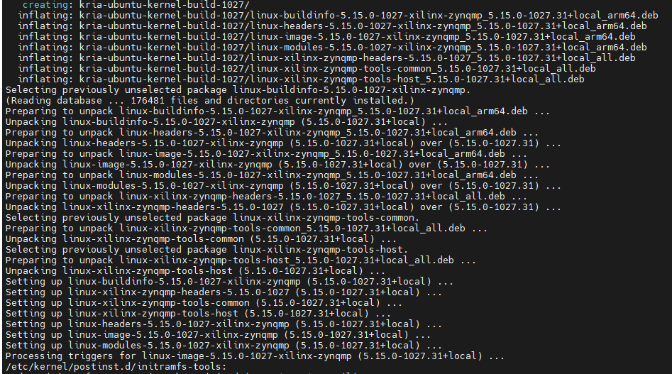
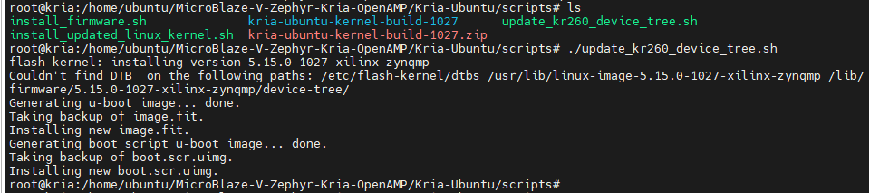
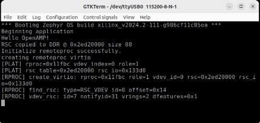
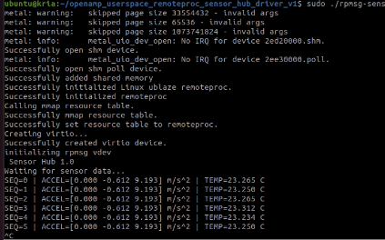
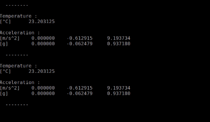

# MicroBlaze-V-Zephyr-Kria-OpenAMP

This directory consists of components to run the OpenAMP Userspace application in KR260. 
  - For any confusion while following the steps below , one can also refer the **Set-up Log** from ***`Kria-Sensor-Fusion-App_setup_log_SSH_M26.sh`*** file attached at this directory.

## Installing components for OpenAMP host application

OpenAMP userspace host application requires update in Ubuntu kernel and device tree .
Run scripts located here to install those updates. 

- If not have then , first git clone this repo at the KR260 board's Ubuntu via terminal
```
cd ~
git clone https://github.com/LogicTronixInc/MicroBlaze-V-Zephyr-Kria-OpenAMP.git
```
- Install Ubuntu Kernel updates 

```
cd ~/MicroBlaze-V-Zephyr-Kria-OpenAMP/Kria-Ubuntu/scripts/
./install_updated_linux_kernel.sh
```




After installation, reboot the board by running `sudo reboot` command at the terminal.

- Install device tree updates
  Run `update_kr260_device_tree.sh` script to update the device tree

```
cd ~/MicroBlaze-V-Zephyr-Kria-OpenAMP/Kria-Ubuntu/scripts/
./update_kr260_device_tree.sh
```


Next copy the device tree blob by running following commands:
```
cd ../device-tree
sudo cp smk-k26-revA-sck-kr-g-revB.dtb /lib/firmware/5.15.0-1027-xilinx-zynqmp/device-tree/xilinx/

sudo flash-kernel
```
<!--  -->
After installation `sudo reboot` the system again. 

- Also install hardware overlay needed for setting up Microblaze and sensors

```
cd ~/MicroBlaze-V-Zephyr-Kria-OpenAMP/Kria-Ubuntu/scripts/
./install_firmware.sh
```

## Installing OpenAMP and libmetal library in Ubuntu

- Install the necessary packages for build:

```
sudo apt update
sudo apt install cmake doxygen libhugetlbfs-dev libsysfs-dev git

```
During last stage of above apt install, there will be message saying `Failed to check for processor microcode upgrades.` , you can dont care this message.

### Installing `libmetal` library from source

- Clone the repository :

```
cd ~
git clone https://github.com/OpenAMP/libmetal.git
cd libmetal
```

- Create a build directory and run CMake:

```
mkdir  build
cd build
cmake ..

```

- Build and install the library

```
make VERBOSE=1
sudo make  install

```

### Installing `OpenAMP` library from source

Next, clone the OpenAMP repository from GitHub and build it, linking against the recently installed libmetal libraries:

- Navigate back to home directory and clone OpenAMP:

```
cd ~
git clone https://github.com/OpenAMP/open-amp.git
cd open-amp

```

- Create a build directory and run CMake

```
mkdir -p build
cd build
cmake .. -DCMAKE_INCLUDE_PATH=/usr/local/include -DCMAKE_LIBRARY_PATH=/usr/local/lib

```

- Build and install the library

```
make VERBOSE=1
sudo make install

```

## Building the OpenAMP Host application

Navigate to this, `Kria-Ubuntu/OpenAMP-HostApp`, directory and build the application by running make command

```
cd ~/MicroBlaze-V-Zephyr-Kria-OpenAMP/Kria-Ubuntu/OpenAMP-HostApp/
make
```

This will create `rpmsg-sensor` OpenAMP host application.

## Running the application

First load the hardware overlay for loading the Microblaze and sensors

- Before loading check the available hardware overlay

```
sudo xmutil listapps
```

This will show the available hardware overlays.

- Load the hardware overlays

```
sudo xmutil unloadapp
sudo xmutil loadapp kr260-zephyr-all-sensor-openamp
```

This will load the Microblaze and Zephyr firmware elf.
After loading the hardware overlay, serial terminal attached to Microblaze will log the information of Microblaze app:



The Microblaze side app will wait for Linux side OpenAMP host application to create the rpmsg channels.
So next run the host applciation by running application build in previously :

```
cd ~/MicroBlaze-V-Zephyr-Kria-OpenAMP/Kria-Ubuntu/OpenAMP-HostApp/
sudo su
export LD_LIBRARY_PATH=$LD_LIBRARY_PATH:/usr/local/lib
 ./rpmsg-sensor
```

This will run host application along with Microblaze side application.
Here are the images of linux and serial console :




### Congratulations for successful run of this sensor fusion Kria-App !!!

*** 

## FAQ
- **How do i re-run this app after successful run once and then have rebooted the Board**
  - You can follow the `## Running the application` step to load the firmware, goto the Openamp-HostApp to run the app as mentioned above.
- **How to add own sensor?**
  - Currently , Pmods sensor/devices are occupying the Pmod ports eventhough they are not completely using GPIO pins available at those 8-GPIO pin based Pomods. To interface own sensor along with these, either one has to take out the Pmod connection to breadboard or external circuit where the Pmod GPIO pin can be connected properly.
  - For the custom sensor out of current Pmod-ACL and Pmod-TMP, one can add new sensor , for that sensor interface (IIC, SPI or other) and its Zephyr device tree, driver and host code has to be customized or written. 

- **Migrating to other Kria Boards or MPSoC boards?**
  - To migrate to other Kria boards, one has to check for number of Pmod-GPIO pins aailable at those boards. According to the number of Pmod-GPIO availability, one can design the VIVADO design, create XSA, device trees and Zephyr device tree (mbv32.dts) and build the zephy app.
  - This app can be migrated to other Xilinx boards, SoC/MPSoC and Versal boards where one can have Microblaze or Microblaze V, and PS (processor).
  - For specific requirement, you can also contact at info@logictronix.com or raise git issue here.

- **Running OpenAMP and host app at Petalinux instead of Kria-Ubuntu?**
  - The Host app code (rpmsg-sensor app) will be the similar for Petalinux also, the only thing has to be done at Petalinux is enable OpenAMP on generated image and setup the `board` device tree as done here at Ubuntu.

- **How to run this Kria-App without internet at KR260**
  - Currently to run this app there are few steps which require `updated kernel download` , apt update and `libmetal` and `openamp` download and setup which require internet connectivity at KR260 board.
  - If you want to setup this step at KR260 without internet , then please contact us. We are provide you the ready to use Ubuntu OS Image or can provide you the offline setup files.


## Known Issues
1. This Kria-App is designed in a way that it requires all 4 Pmod sensor/devices needs to be connected while running.
2. Currently there are two reboot required during setup and first run of this app. At the second run one can just start from `## Running the application` so there is no reboot needed.
3. For any error while loading firmware or app - one can unload the firmware and reload it again or reboot the system onece and re-run the step.

***